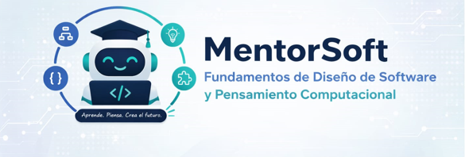

# Proyecto de especialización en desarrollo de software: Tutor inteligente para fundamentos de diseño de software y pensamiento computacional



## Descripción del proyecto

Este proyecto tiene como objetivo principal potenciar el dominio de los fundamentos de desarrollo de software y las habilidades de pensamiento computacional en estudiantes que ingresan a programas de ingeniería de software, mediante el diseño e implementación de un tutor inteligente con capacidades de diagnóstico adaptativo y generación de rutas de aprendizaje personalizadas.

## Stack tecnológico

- **Lenguaje:** Python 3.13
- **Framework:** FastAPI (async)
- **ORM:** SQLAlchemy 2.x con soporte async (asyncpg)
- **Base de datos:** PostgreSQL 16 (via Docker en desarrollo)
- **Cola de mensajes:** AWS SQS (Floci en desarrollo)
- **Autenticación:** JWT con refresh tokens
- **Email:** Brevo (transaccional)
- **LLM Qualifiers:** Groq / OpenCode (calificación con modelos de lenguaje)
- **Testing:** pytest con fixtures asíncronas
- **Infraestructura:** Docker Compose (PostgreSQL + Floci en desarrollo)

## Arquitectura del proyecto

Este proyecto a nivel de backend se hace mediante un **monolito modular**, con una **arquitectura de capas verticales basadas en features**. Esto permite una mejor organización del código y facilita el mantenimiento y escalabilidad del proyecto. El sistema cuenta con tres features principales: `user_management`, `content_management` y `assessments`, además de un qualifier infrastructure para calificación con LLM.

La estructura del proyecto se organizará de la siguiente manera:

- `src/`: Contiene el código principal de la aplicación, organizado en módulos según las features.
  - `features/`: Cada feature tiene su propio módulo con sus operaciones. Cada operación contiene sus capas (endpoint, handler, request, response). Los recursos compartidos (repositorios, modelos, dependencias) viven en `shared/`.
    - `user_management/`: Gestión de usuarios (crear, login, recuperar contraseña, cambiar contraseña, asignar roles, refresh token)
    - `content_management/`: Gestión de contenidos (listar, registrar, calificar, actualizar, buscar por título, tema o categoría)
    - `assessments/`: Gestión de evaluaciones y preguntas (registrar preguntas, obtener preguntas por nivel/categoría, actualizar preguntas, obtener evaluación, guardar respuestas, evaluar, obtener categorías de preguntas, obtener todas las preguntas, obtener preguntas pendientes de aprobación, revisar preguntas)
    - `shared/`: Abstracciones compartidas como NotificationService
  - `infrastructure/`: Implementación de infraestructura concreta.
    - `database/postgresql/`: Repositorios y modelos PostgreSQL (user, role, content, ratings, tokens, questions, assessments)
    - `broker/aws/`: Implementación de AWS SQS (publisher, consumer, connection factory)
    - `notification/`: Implementación del servicio de notificaciones (Brevo)
    - `qualifier/`: Implementación de servicios de calificación con LLM (Groq, OpenCode)
    - `security/`: Implementación de seguridad (JWT token generator, Bcrypt password hasher)
  - `main.py`: Punto de entrada de la aplicación.
- `tests/`: Tests unitarios y de integración.

```bash
src/
├── features/
│   ├── user_management/
│   │   ├── create_user/
│   │   ├── login/
│   │   ├── get_user/
│   │   ├── recovery_password/
│   │   ├── change_password/
│   │   ├── assign_role/
│   │   ├── get_available_roles/
│   │   ├── refresh_token/
│   │   └── shared/
│   │       ├── user.py
│   │       ├── user_repository.py
│   │       ├── role.py
│   │       ├── role_repository.py
│   │       ├── refresh_token_repository.py
│   │       ├── user_recovery_token_repository.py
│   │       ├── password_hasher.py
│   │       ├── token_generator.py
│   │       ├── get_current_user.py
│   │       ├── require_roles.py
│   │       ├── dependencies.py
│   │       └── init.py
│   ├── content_management/
│   │   ├── get_all_contents/
│   │   ├── get_resource_content/
│   │   ├── register_content/
│   │   ├── update_resource_content/
│   │   ├── rate_content/
│   │   ├── get_contents_by_topic/
│   │   ├── get_contents_by_category/
│   │   ├── get_contents_by_title/
│   │   ├── get_contents_by_category_topic/
│   │   └── shared/
│   │       ├── content.py
│   │       ├── content_repository.py
│   │       ├── dependencies.py
│   │       └── init.py
│   ├── assessments/
│   │   ├── register_question/
│   │   ├── get_question_by_id/
│   │   ├── get_questions_by_level/
│   │   ├── get_questions_by_category/
│   │   ├── update_question/
│   │   ├── get_assessment/
│   │   ├── get_assessment_by_topic/
│   │   ├── save_assessments_answers/
│   │   ├── evaluate/
│   │   ├── get_question_categories/
│   │   ├── get_all_questions/
│   │   ├── get_pending_approval_questions/
│   │   ├── save_review_question/
│   │   └── shared/
│   │       ├── question.py
│   │       ├── question_details.py
│   │       ├── questions_repository.py
│   │       ├── question_assessment_repository.py
│   │       ├── questions_cache_repository.py
│   │       ├── assessment.py
│   │       ├── assessment_repository.py
│   │       ├── qualifier_service.py
│   │       ├── get_assessment_service.py
│   │       ├── review_question_service.py
│   │       ├── questions_seeder.py
│   │       ├── dependencies.py
│   │       └── init.py
│   └── shared/
│       └── notification_service.py
├── infrastructure/
│   ├── database/
│   │   └── postgresql/
│   │       ├── models/
│   │       │   ├── postgresql_user_model.py
│   │       │   ├── postgresql_user_mapper.py
│   │       │   ├── postgresql_role_model.py
│   │       │   ├── postgresql_role_mapper.py
│   │       │   ├── postgresql_resource_content.py
│   │       │   ├── postgresql_resource_content_mapper.py
│   │       │   ├── postgresql_content_rating.py
│   │       │   ├── postgresql_content_rating_mapper.py
│   │       │   ├── postgresql_question_model.py
│   │       │   ├── postgresql_question_mapper.py
│   │       │   ├── postgresql_assessment_model.py
│   │       │   ├── postgresql_assessment_mapper.py
│   │       │   ├── postgresql_user_refresh_token_model.py
│   │       │   ├── postgresql_user_refresh_token_mapper.py
│   │       │   ├── postgresql_user_recovery_token_model.py
│   │       │   └── postgresql_user_recovery_token_mapper.py
│   │       ├── repository/
│   │       │   ├── postgresql_user_repository.py
│   │       │   ├── postgresql_role_repository.py
│   │       │   ├── postgresql_resource_content_repository.py
│   │       │   ├── postgresql_content_rating_repository.py
│   │       │   ├── postgresql_user_refresh_token_repository.py
│   │       │   ├── postgresql_user_recovery_token_repository.py
│   │       │   ├── postgresql_questions_repository.py
│   │       │   ├── postgresql_assessment_repository.py
│   │       │   └── postgresql_questions_assessment_repository.py
│   │       └── shared/
│   │           ├── postgresql_database_session.py
│   │           └── postgresql_seeder.py
│   ├── broker/
│   │   └── aws/
│   │       ├── models/
│   │       │   ├── aws_sqs_client.py
│   │       │   └── aws_sqs_consumer_config.py
│   │       └── services/
│   │           ├── aws_sqs_connection_factory.py
│   │           ├── aws_sqs_publisher_service.py
│   │           ├── aws_sqs_consumer_service.py
│   │           ├── aws_sqs_consumer_qualification.py
│   │           ├── aws_sqs_creator_service.py
│   │           └── aws_sqs_manager.py
│   ├── notification/
│   │   └── brevo_notification_service.py
│   ├── qualifier/
│   │   ├── groq_qualifier_service.py
│   │   ├── opencode_qualifier_service.py
│   │   ├── input_prompt.txt
│   │   └── input_prompt_batch.txt
│   └── security/
│       ├── jwt_token_generator.py
│       └── bcrypt_password_hasher.py
└── main.py
```

Para más detalles sobre la arquitectura del proyecto, puedes consultar el documento [ARCHITECTURE.md](docs/ARCHITECTURE.md).

## API Endpoints

### User Management (`/users`)

| Método | Endpoint | Descripción |
| -------- | ---------- | ------------- |
| POST | `/users/create` | Crear nuevo usuario |
| POST | `/users/login` | Iniciar sesión |
| GET | `/users/me` | Obtener usuario actual |
| POST | `/users/recovery-password` | Solicitar recuperación de contraseña |
| POST | `/users/change-password` | Cambiar contraseña |
| POST | `/users/assign-role` | Asignar rol a usuario |
| GET | `/users/available-roles` | Obtener roles disponibles |
| POST | `/users/refresh-token` | Refrescar token de acceso |

### Content Management (`/content`)

| Método | Endpoint | Descripción |
| -------- | ---------- | ------------- |
| GET | `/content` | Listar todos los contenidos |
| GET | `/content/{id}` | Obtener contenido por ID |
| POST | `/content/register` | Registrar nuevo contenido |
| PUT | `/content/{id}` | Actualizar contenido |
| POST | `/content/rate` | Calificar contenido |
| GET | `/content/by-topic` | Buscar contenidos por tema |
| GET | `/content/by-category` | Buscar contenidos por categoría |
| GET | `/content/by-title` | Buscar contenidos por título |
| GET | `/content/by-category-topic` | Buscar contenidos por categoría y tema |

### Assessments (`/assessments`)

| Método | Endpoint | Descripción |
| -------- | ---------- | ------------- |
| GET | `/assessments/` | Obtener evaluación generada |
| GET | `/assessments/topic` | Obtener evaluación por tema |
| POST | `/assessments/` | Guardar respuestas de evaluación |
| POST | `/assessments/questions/register` | Registrar nueva pregunta |
| GET | `/assessments/questions` | Obtener todas las preguntas (paginado) |
| GET | `/assessments/questions/{question_id}` | Obtener pregunta por ID |
| GET | `/assessments/questions/level/{difficulty}` | Obtener preguntas por nivel de dificultad |
| GET | `/assessments/questions/category/{category}` | Obtener preguntas por categoría |
| PUT | `/assessments/questions/{question_id}` | Actualizar pregunta |
| GET | `/assessments/categories` | Obtener categorías de preguntas |
| GET | `/assessments/pending-approval-questions` | Obtener preguntas pendientes de aprobación |
| POST | `/assessments/review` | Revisar y aprobar/rechazar pregunta |

## Configuración del entorno de desarrollo

Para obtener detalles sobre cómo configurar el entorno de desarrollo, puedes consultar el documento [SETUP.md](docs/SETUP.md).

## Desarrollo mediante Git Flow

Este proyecto sigue el modelo de desarrollo Git Flow, que se basa en ramas específicas para cada tipo de trabajo. Las ramas principales son:

- `master`: Rama principal que contiene el código de producción.
- `develop`: Rama de desarrollo donde se integran las nuevas funcionalidades antes de ser fusionadas a `master`.
- `feature/*`: Ramas para el desarrollo de nuevas funcionalidades. Se crean a partir de `develop` y se fusionan de nuevo a `develop` una vez que la funcionalidad está completa.
- `release/*`: Ramas para preparar una nueva versión. Se crean a partir de `develop` y se fusionan a `master` y `develop` una vez que la versión está lista para ser lanzada.
- `hotfix/*`: Ramas para corregir errores críticos en producción. Se crean a partir de `master` y se fusionan a `master` y `develop` una vez que el error ha sido corregido.

## Licencia

Este proyecto está licenciado bajo la Licencia MIT. Puedes consultar el archivo [LICENSE](LICENSE) para más detalles sobre los términos de la licencia.
