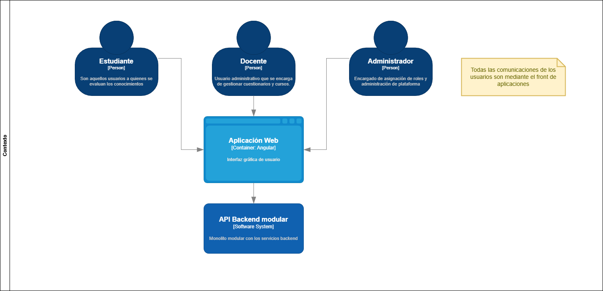

# Arquitectura del proyecto

Este proyecto a nivel de backend se hace mediante un **monolito modular**, con una **arquitectura de capas verticales basadas en features**. Esto permite una mejor organización del código y facilita el mantenimiento y escalabilidad del proyecto.

## Estructura general

```bash
src/
├── features/          # Features con sus operaciones (capas verticales)
├── infrastructure/    # Implementaciones concretas de infraestructura
└── main.py            # Punto de entrada FastAPI
```

## Arquitectura de features (capas verticales)

Cada feature vive en su propio módulo y contiene todas sus capas:

```bash
features/
└── {feature_name}/
    ├── {operation_a}/          # Una operación = una unidad de negocio
    │   ├── {operation}_endpoint.py   # Capa de presentación (FastAPI)
    │   ├── {operation}_handler.py    # Capa de lógica de negocio
    │   ├── {operation}_request.py    # Esquema de request
    │   └── {operation}_response.py   # Esquema de response
    ├── {operation_b}/
    └── shared/                        # Recursos compartidos del feature
        ├── {domain_model}.py         # Modelo de dominio
        ├── {repository}.py           # Interfaz/abstracción del repositorio
        ├── dependencies.py           # Inyección de dependencias
        └── init.py                   # Agrega todos los routers
```

**Beneficios de esta estructura:**

- Cada feature es autocontenida (endpoint, handler, request, response)
- Los recursos compartidos (repositorios, modelos) viven en `shared/`
- Agregar una nueva operación no requiere modificar código existente
- Cada feature tiene su propio `__init__.py` que exporta su router principal

## Features implementados

### User Management (`/users`)

Gestión completa de usuarios y autenticación:

| Operación | Descripción |
| ----------- | ------------- |
| `create_user` | Registro de nuevos usuarios |
| `login` | Autenticación con JWT |
| `get_user` | Obtener perfil del usuario actual |
| `recovery_password` | Solicitar recuperación de contraseña (envía email) |
| `change_password` | Cambiar contraseña con token de recuperación |
| `assign_role` | Asignar roles a usuarios |
| `get_available_roles` | Listar roles disponibles |
| `refresh_token` | Refrescar token de acceso |

**Recursos compartidos:**

- `User` - Modelo de dominio
- `UserRepository` - Abstracción del repositorio de usuarios
- `RoleRepository` - Abstracción del repositorio de roles
- `RefreshTokenRepository` - Abstracción para tokens de refresh
- `UserRecoveryTokenRepository` - Abstracción para tokens de recuperación
- `PasswordHasher` - Abstracción para hashing de contraseñas
- `TokenGenerator` - Abstracción para generación de JWT
- `get_current_user` - Servicio para obtener usuario autenticado
- `require_roles` - Middleware de autorización basada en roles

### Content Management (`/content`)

Gestión de contenidos educativos:

| Operación | Descripción |
| ----------- | ------------- |
| `get_all_contents` | Listar todos los contenidos |
| `get_resource_content` | Obtener contenido específico por ID |
| `register_content` | Registrar nuevo contenido educativo |
| `rate_content` | Calificar un contenido |
| `get_contents_by_topic` | Filtrar contenidos por tema |
| `get_contents_by_category` | Filtrar contenidos por categoría |
| `get_contents_by_title` | Buscar contenidos por título |
| `get_contents_by_category_topic` | Filtrar por categoría y tema |
| `update_resource_content` | Actualizar contenido existente |

**Recursos compartidos:**

- `Content` - Modelo de dominio
- `ContentRepository` - Abstracción del repositorio de contenidos

### Assessments (`/assessments`)

Gestión de evaluaciones, preguntas y calificación de respuestas:

| Operación | Descripción |
| ----------- | ------------- |
| `register_question` | Registrar nueva pregunta |
| `get_question_by_id` | Obtener pregunta por ID |
| `get_questions_by_level` | Obtener preguntas por nivel de dificultad |
| `get_questions_by_category` | Obtener preguntas por categoría |
| `update_question` | Actualizar pregunta existente |
| `get_assessment` | Obtener evaluación |
| `get_assessment_by_topic` | Obtener evaluación por tema |
| `save_assessments_answers` | Guardar respuestas del estudiante |
| `evaluate` | Evaluar respuestas con LLM |
| `get_question_categories` | Listar categorías de preguntas disponibles |
| `get_all_questions` | Listar todas las preguntas |
| `get_pending_approval_questions` | Obtener preguntas pendientes de aprobación |
| `save_review_question` | Guardar revisión de pregunta |

**Recursos compartidos:**

- `Question` - Modelo de dominio de pregunta (con QuestionBuilder, QuestionDifficulty, QuestionStatus, QuestionRubricScore, QuestionReview)
- `Assessment` - Modelo de dominio de evaluación (con AssessmentAnswer, AssessmentQuiz, EvaluatorQuestion)
- `PaginatedQuestionsResult` - Resultado paginado de preguntas
- `QualifierService` - Abstracción del servicio de calificación LLM
- `QualifierPrompt` / `BatchQualifierPrompt` - Prompts para calificación
- `QualifierResult` / `TopicResult` - Resultados de calificación
- `QuestionsRepository` - Abstracción del repositorio de preguntas
- `QuestionAssessmentRepository` - Abstracción del repositorio de preguntas de evaluación
- `QuestionsCacheRepository` - Abstracción del repositorio cache de preguntas
- `AssessmentRepository` - Abstracción del repositorio de evaluaciones
- `GetAssessmentService` - Servicio de obtención de evaluaciones
- `ReviewQuestionService` - Servicio de revisión de preguntas
- `QualifierService` (infrastructure) - Servicio de calificación con LLM
- `QuestionsSeeder` - Seeder de preguntas desde JSON

## Infrastructure

Capa de implementación concreta que sustenta a las features:

```bash
infrastructure/
├── database/
│   └── sqllite/           # Implementación SQLite
│       ├── models/        # Modelos de base de datos + mappers
│       ├── repository/    # Implementaciones concretas de repositorios
│       └── shared/        # Sesión de BD y seeder
├── notification/
│   └── brevo_notification_service.py  # Implementación con Brevo API
└── security/
    ├── jwt_token_generator.py         # Implementación JWT
    └── bcrypt_password_hasher.py      # Implementación bcrypt
└── qualifier/
    ├── groq_qualifier_service.py      # Calificación con Groq API
    ├── opencode_qualifier_service.py  # Calificación con OpenAI API
    ├── input_prompt.txt               # Template prompt individual
    └── input_prompt_batch.txt         # Template prompt batch
```

### SQLite Models

| Modelo | Descripción |
| ----------- | ------------- |
| `UserEntity` | Modelo de usuario en BD |
| `RoleEntity` | Modelo de rol en BD |
| `ResourceContentEntity` | Modelo de contenido educativo |
| `ContentRating` | Modelo de calificaciones |
| `QuestionEntity` | Modelo de pregunta en BD |
| `AssessmentEntity` | Modelo de evaluación en BD |

### Repositorios SQLite

| Repositorio | Descripción |
| ----------- | ------------- |
| `SqlLiteUserRepository` | Persistencia de usuarios |
| `SqlLiteRoleRepository` | Persistencia de roles |
| `SqlLiteResourceContentRepository` | Persistencia de contenidos |
| `SqlLiteContentRatingRepository` | Persistencia de calificaciones |
| `SqlLiteUserRefreshTokenRepository` | Tokens de refresh |
| `SqlLiteUserRecoveryTokenRepository` | Tokens de recuperación |
| `SqlliteQuestionsRepository` | Persistencia de preguntas |
| `SqlliteAssessmentRepository` | Persistencia de evaluaciones |
| `SqlLiteQuestionsAssessmentRepository` | Persistencia de preguntas de evaluación |

### Qualifier (LLM)

Capa de implementación de servicios de calificación inteligente:

| Servicio | Descripción |
| ----------- | ------------- |
| `GroqQualifierService` | Calificación de respuestas usando Groq API |
| `OpencodeQualifierService` | Calificación de respuestas usando OpenAI API |

**Prompt templates:**

| Archivo | Descripción |
| ----------- | ------------- |
| `input_prompt.txt` | Template de prompt para calificación individual |
| `input_prompt_batch.txt` | Template de prompt para calificación en lote |

## Flujo de dependencias

```bash
┌─────────────────────────────────────────────────────────┐
│                    main.py                              │
│              (FastAPI app + lifespan)                   │
└────────────────────────┬────────────────────────────────┘
                         │
           ┌──────────────┼──────────────┐
           │              │              │
     ┌─────▼─────┐ ┌─────▼─────┐ ┌─────▼─────┐
     │  users    │ │  content  │ │assessments│
     │  router   │ │  router   │ │  router   │
     └─────┬─────┘ └─────┬─────┘ └─────┬─────┘
           │              │              │
     ┌─────▼─────┐ ┌─────▼─────┐ ┌─────▼─────┐
     │  handler  │ │  handler  │ │  handler  │
     │  (lógica) │ │  (lógica) │ │  (lógica) │
     └─────┬─────┘ └─────┬─────┘ └─────┬─────┘
           │              │              │
     ┌─────▼──────────────▼──────────────▼─────┐
     │         interfaces de repositorio       │
     │         (abstracciones)                 │
     └─────┬───────────────────────────────────┘
           │
     ┌─────▼───────────────────────────────────┐
     │         infrastructure                  │
     │   (implementaciones concretas)          │
     │  ┌──────────┐  ┌────────────┐  ┌───────┐│
     │  │ SQLite   │  │ Brevo      │  │ JWT   ││
     │  │          │  │ Notification│ │ Bcrypt││
     │  └──────────┘  └────────────┘  └───────┘│
     │  ┌──────────────────────────────────────┐│
     │  │ Qualifier (LLM)                      ││
     │  │  GroqQualifierService                ││
     │  │  OpencodeQualifierService            ││
     │  └──────────────────────────────────────┘│
     └──────────────────────────────────────────┘
```

## Diagramas de arquitectura

A continuación se presentan los diagramas de arquitectura del proyecto:

### Diagrama de contexto



### Diagrama de contenedores


