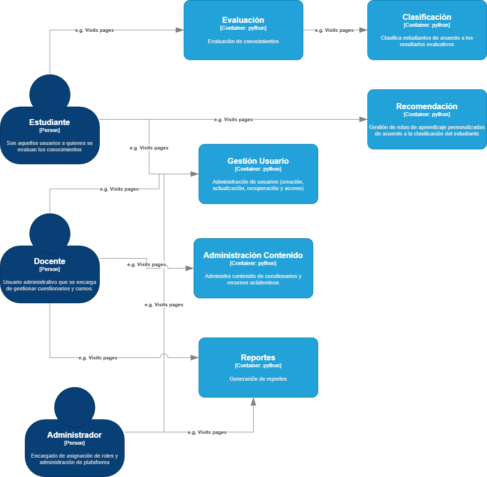

# Arquitectura del proyecto

Este proyecto a nivel de backend se hará mediante un **monolito modular**, con una **arquitectura de capas verticales basadas en features**. Esto permitirá una mejor organización del código y facilitará el mantenimiento y escalabilidad del proyecto.

La estructura del proyecto se organizará de la siguiente manera:

- `app/`: Contendrá el código principal de la aplicación, organizado en módulos según las features.
  - `features/`: Cada feature tendrá su propio módulo con sus respectivas capas (controladores, servicios, repositorios).
  - `infrastructure/`: Contendrá la implementación de la infraestructura necesaria para la aplicación, como la conexión a bases de datos, servicios externos, etc.
  - `main.py`: Punto de entrada de la aplicación.
- `tests/`: Contendrá los tests unitarios y de integración para asegurar la calidad del código.

```bash
├── app/
│   ├── features/
│   │   ├── user-management/
│   │   │    ├── create_user/
│   │   │    │   ├── create_user_endpoint.py
│   │   │    │   ├── create_user_handler.py
│   │   │    │   ├── create_user_request.py
│   │   │    ├── login/
│   │   │    ├── shared/
│   │   │    │   ├── init.py
│   │   │    │   ├── user_repository.py
│   │   │    │   ├── user.py
│   │   ├── content-management/
│   │   ├── evaluation/
│   │   ├── classification/
│   │   ├── recommendation/
│   │   ├── reporting/
│   ├── infrastructure/
│   ├── main.py
├── tests/
```

## Diagramas de arquitectura

A continuación se presentan los diagramas de arquitectura del proyecto:

### Diagrama de contenedores


